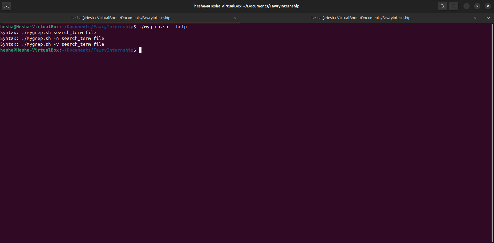
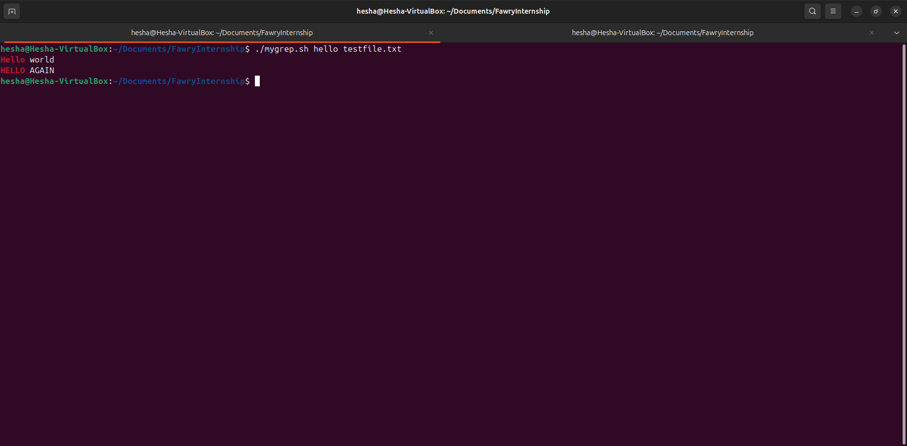
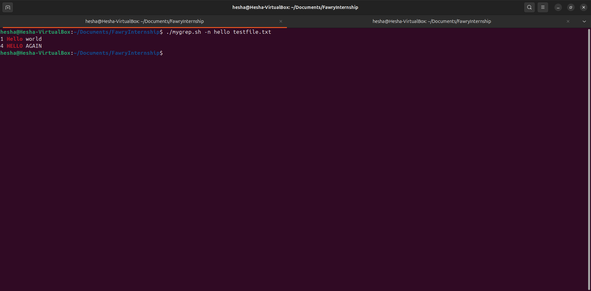
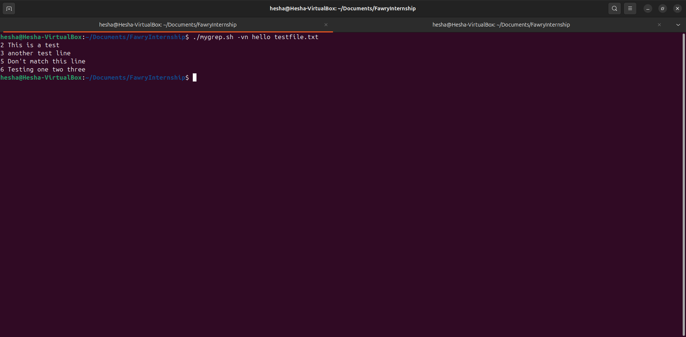
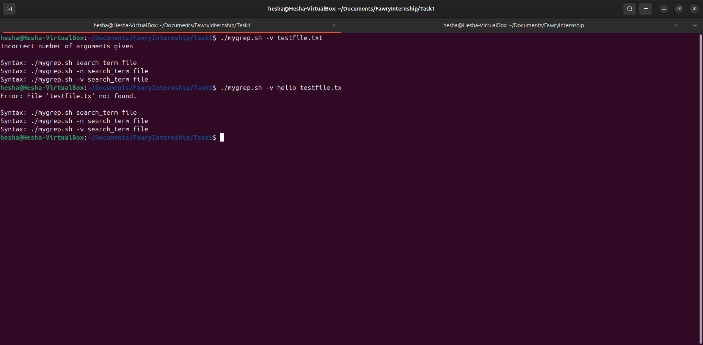

# mygrep.sh

A custom Bash script that extends the functionality of `grep`, offering **case-insensitive search**, **colored highlighting**, **line numbering**, and **inverted matches** — all in a single portable script.

---

## Table of Contents
- [Features](#features)
- [Visual Overview](#visual-overview)
- [Installation](#installation)
- [Usage](#usage)
- [Options](#options)
- [Examples](#examples)
- [Error Handling](#error-handling)
- [Design Details](#design-details)
- [Why Use mygrep.sh?](#why-use-mygrepsh)
- [Author](#author)

---

## Features

✅ **Case-Insensitive Search**: Automatically matches text without worrying about letter case.  
✅ **Colored Highlighting**: Search term matches are highlighted in red for better visibility.  
✅ **Line Numbering (`-n`)**: Show the line number of each match.  
✅ **Inverted Search (`-v`)**: Display lines that *do not* match the search term.  
✅ **Combined Flags (`-nv` or `-vn`)**: Mix options for even more flexible searching.  
✅ **Input Validation**: Verifies argument count and file existence before searching.  
✅ **Special Character Handling**: Properly escapes special characters to avoid pattern mismatches.  
✅ **Minimal Dependencies**: Pure Bash implementation — no need for external tools beyond basic shell utilities.

---

## Visual Overview

> See the script in action!

   
*Figure 1: Usage help output — shows available options and correct syntax.*

---

   
*Figure 2: Searching for "line" across the file, highlighting every match.*

---

   
*Figure 3: `-n` option enabled — displaying matches alongside their line numbers.*

---

   
*Figure 4: `-v` option enabled — displaying lines that **do not** contain the search term.*

---

   
*Figure 5: Combined `-nv` flags — showing numbered non-matching lines.*

---

   
*Figure 6: Error handling demonstration — missing arguments or file issues trigger clear usage messages.*

---

## Installation

1. Download or clone this repository to your local machine.
2. Give execution permission to `mygrep.sh`:
   ```bash
   chmod +x mygrep.sh
   ```
3. Now you're ready to use it!

---

## Usage

Run the script with one of the following syntaxes:

```bash
# Basic search (case-insensitive)
./mygrep.sh <search_term> <file>

# Search and show line numbers
./mygrep.sh -n <search_term> <file>

# Invert search (show lines NOT matching)
./mygrep.sh -v <search_term> <file>

# Invert search with line numbers
./mygrep.sh -nv <search_term> <file>
./mygrep.sh -vn <search_term> <file>

# Help
./mygrep.sh --help
```

---

## Options

| Option | Description |
|:------:|:------------|
| `-n` | Display line numbers with matching lines. |
| `-v` | Invert search to show non-matching lines. |
| `-nv` or `-vn` | Combine line numbers with inverted search. |
| `--help` | Show usage instructions. |

**Note**:  
- All searches are case-insensitive by default.
- Options must be placed before the search term and filename.

---

## Examples

```bash
# Find "apple" in fruits.txt and highlight matches
./mygrep.sh apple fruits.txt

# Find "banana" with line numbers
./mygrep.sh -n banana fruits.txt

# Show lines without "TODO" in notes.txt
./mygrep.sh -v TODO notes.txt

# Show numbered lines that do NOT contain "hello"
./mygrep.sh -nv hello example.txt
```

---

## Error Handling

The script provides robust error handling for:

- **Incorrect Argument Count**:
  - Displays: `Incorrect number of arguments given`
  - Shows the correct usage formats.

- **Non-Existent File**:
  - Displays: `Error: File 'filename' not found.`
  - Exits gracefully with usage instructions.

- **Invalid Options**:
  - If an unsupported option is given, falls back to usage guidance.

This ensures users are always guided toward the right usage without silent failures.

---

## Design Details

- **Highlighting Engine**:
  - Built with `awk` inside Bash for efficient, colorful, and case-insensitive highlighting.

- **Special Characters**:
  - The script safely escapes characters like `.`, `*`, `[`, `]`, and `|` from the search term to avoid unintended regex behavior.

- **Cross-Platform Compatibility**:
  - Works on any system with basic Bash and `awk` installed — no third-party libraries needed.

- **Lightweight**:
  - Designed to be minimal yet powerful — ideal for small systems or educational purposes.

---

## Why Use mygrep.sh?

✨ **Educational Value**: Learn how Bash scripting handles string operations, input validation, and file parsing.  
✨ **Customization**: Modify the script easily for custom search behaviors.  
✨ **Highlight Focus**: Unlike default `grep`, this version highlights the exact matches in bright red for visibility.  
✨ **Simple Yet Powerful**: No external dependencies — ideal for portable scripts, lightweight systems, or minimalistic workflows.  
✨ **User-Friendly Errors**: Always shows helpful syntax messages when a mistake is made.

---

## Author

**Hesha**  
- Developed for the **Fawry Internship** program.

---

