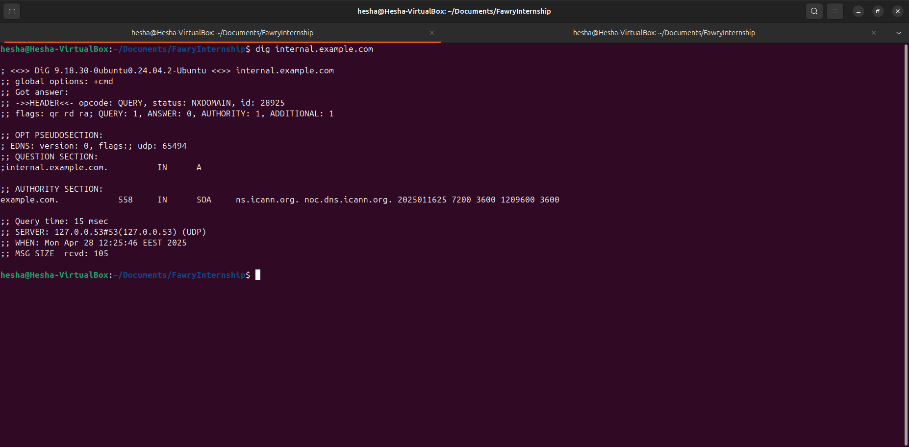
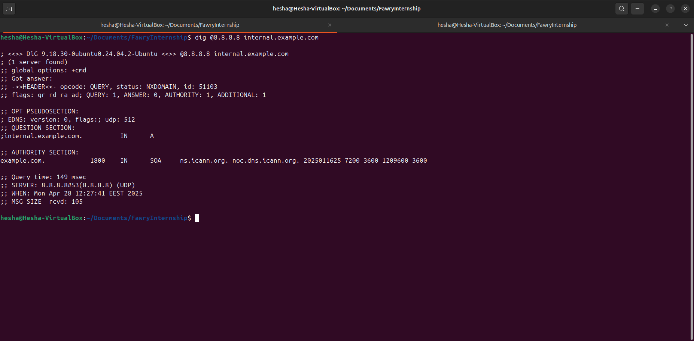
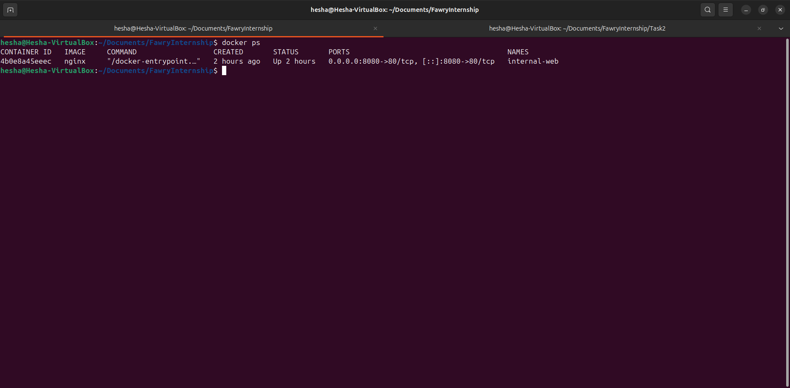
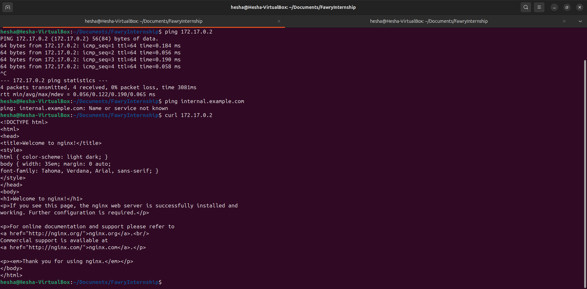
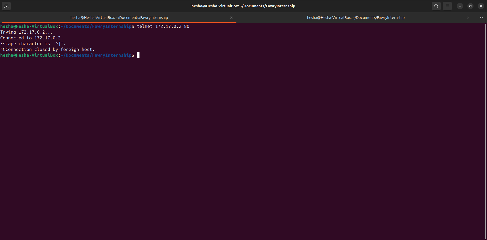
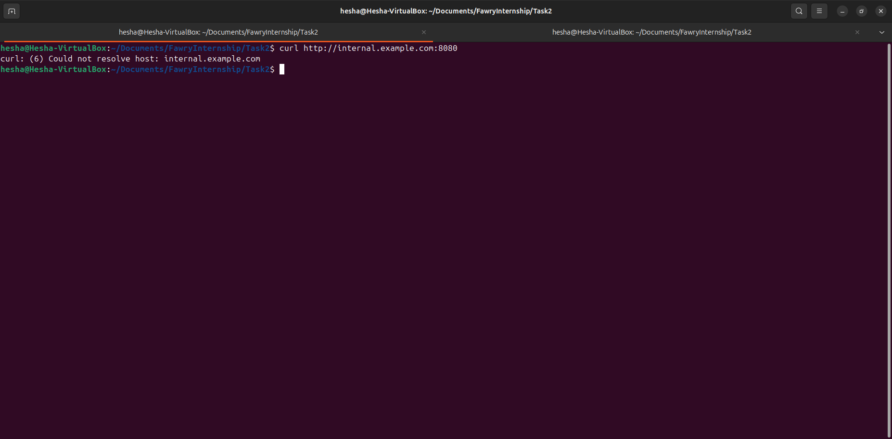

# 🛠️ Internal DNS & Service Reachability Simulation

## Table of Contents
- [Overview](#overview)
- [1. DNS Resolution Verification](#1-dns-resolution-verification)
- [2. Service Reachability Diagnosis](#2-service-reachability-diagnosis)
- [3. Trace and List Possible Causes for Unreachability](#3-trace-and-list-possible-causes-for-unreachability)
- [4. Proposed Fixes](#4-proposed-fixes)
- [5. Key Diagnosis Based on the Scenario](#5-key-diagnosis-based-on-the-scenario)
- [Bonus: DNS Bypass and Persistent DNS Configuration](#bonus-dns-bypass-and-persistent-dns-configuration)
- [Notes](#notes)

---

## Overview

This project simulates a realistic troubleshooting scenario where an internal web service (`internal.example.com`) needs to be resolved and accessed inside a controlled environment.

You will:
- Create an internal domain using Docker and `/etc/hosts`.
- Test service reachability via `curl`, `ping`, and `dig`.
- Simulate and diagnose "Host Not Found" errors.

---

## 1. DNS Resolution Verification

### Step 1.1 — Check resolution via `/etc/resolv.conf`

    dig internal.example.com

📸 **Screenshot:**

### Step 1.2 — Check resolution using external DNS (8.8.8.8)

    dig @8.8.8.8 internal.example.com

📸 **Screenshot:**

---

## 2. Service Reachability Diagnosis

### Step 2.1 — Check if the ports are mapped correctly

    docker ps

📸 **Screenshot:**

### Step 2.2 — Access service using curl

    curl http://internal.example.com:8080

📸 **Screenshot:**

### Step 2.3 — Check if container is listening on ports 80 and 443

    sudo netstat -tuln | grep ':80\|:443'
    sudo ss -tuln | grep ':80\|:443'

---

## 3. Trace and List Possible Causes for Unreachability

| Potential Cause                          | Notes                                          |
|-------------------------------------------|------------------------------------------------|
| DNS not properly resolving               | Check `/etc/hosts` or internal DNS server      |
| Service container not running            | Verify with `docker ps`                        |
| Port mapping incorrect                   | Ensure Docker publishes port 8080 correctly    |
| Wrong IP mapping in `/etc/hosts`          | Must point to correct localhost IP             |
| Firewall blocking port 8080               | Check with `sudo ufw status`                   |

---

## 4. Proposed Fixes

Below are the possible issues and how to detect and resolve each one.

---

### 4.1 DNS Not Properly Resolving

**Diagnosis:**  
- Run `dig internal.example.com` and check if an IP address is returned.
- Inspect `/etc/hosts` for the correct entry.

**Fix:**  
Add or correct the entry in `/etc/hosts`:

    sudo nano /etc/hosts

Add the following line:

    <container ip>    internal.example.com

---

### 4.2 Service Container Not Running

**Diagnosis:**  
- Run `docker ps` to check if the `internal-web` container is running.

**Fix:**  
If not running, start the container:

    docker start <container name/id>

Or recreate it:

    docker run -d --name internal-web -p 8080:80 nginx

---

### 4.3 Port Mapping Incorrect

**Diagnosis:**  
- Check published ports using `docker ps` and verify that port 8080 is forwarded to container port 80.

**Fix:**  
If incorrect, stop and remove the container:

    docker rm -f internal-web

Then recreate it with correct port mapping:

    docker run -d --name internal-web -p 8080:80 nginx

---

### 4.4 Wrong IP Mapping in `/etc/hosts`

**Diagnosis:**  
- Open `/etc/hosts` and ensure that `internal.example.com` points to <container ip>.

**Fix:**  
Correct the IP address in `/etc/hosts`:

    sudo nano /etc/hosts

Make sure the line reads:

    <container ip>    internal.example.com

---

### 4.5 Firewall Blocking Port 8080

**Diagnosis:**  
- Check firewall status:

    `sudo ufw status`

Look for any rules blocking port 8080.

**Fix:**  
Allow traffic on port 8080:

    sudo ufw allow 8080/tcp
    sudo ufw reload

Then verify:

    sudo ufw status

---

## 5. Key Diagnosis Based on the Scenario

In the screenshots provided, it is evident that:

- We can **ping the server using its IP address**.
- We **cannot reach the server using the domain name** (`internal.example.com`).

**Conclusion:**  
This clearly indicates a **DNS resolution problem**, not a network or service availability issue.

✅ **Applying Fix 4.1 (DNS Not Properly Resolving)** — by correctly setting up the `/etc/hosts` entry — will resolve this issue.

---

## Bonus: DNS Bypass and Persistent DNS Configuration

---

### Bonus 1 — Configure `/etc/hosts` to Bypass DNS

**Steps:**
1. Open the `/etc/hosts` file:

    sudo nano /etc/hosts

2. Add an entry mapping the internal hostname to the container's IP:

    <container ip>    internal.example.com

This forces the system to resolve `internal.example.com` without needing an external DNS server.

---

### Bonus 2 — Persist DNS Server Settings with `systemd-resolved`

If you want to set custom DNS servers permanently (e.g., Google's 8.8.8.8 or internal DNS):

1. Create or edit the override configuration:

    sudo mkdir -p /etc/systemd/resolved.conf.d/
    sudo nano /etc/systemd/resolved.conf.d/dns_servers.conf

2. Add the following content:

    [Resolve]
    DNS=8.8.8.8 1.1.1.1
    FallbackDNS=9.9.9.9

3. Restart systemd-resolved:

    sudo systemctl restart systemd-resolved

4. Confirm the active DNS servers:

    resolvectl --status

---

## Notes

Always restart `systemd-resolved` after making DNS changes if necessary:

    sudo systemctl restart systemd-resolved

To simulate "Host Not Found", simply remove or comment the `internal.example.com` line from `/etc/hosts`.

---

## Author

**Muhammad Ahmad Hesham**  
- Developed during the **Fawry Internship Program** 2025.

---
